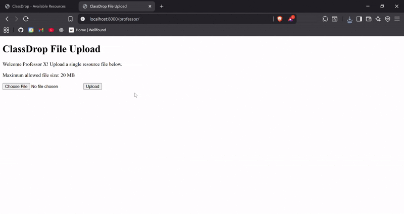

# 📚 ClassDrop

A minimal, lightweight file sharing API service intended for a university professor to share resource files with their students. Supports uploads and downloads, stores files on disk, and makes it easy to retrieve shared files via a simple HTTP endpoint.



## Dependencies
 - Python 3.10+ (tested on 3.13.3)
 - pip 24+
 - FastAPI
 - Uvicorn

All dependencies are listed in `requirements.txt`. Install them with:
```console
pip install -r requirements.txt
```

## Get Started


### 1️⃣ Clone the Repository
```console
git clone https://github.com/maurodeluca/classdrop.git
cd classdrop
```

### 2️⃣ Create a Virtual Environment

It's recommend to use a virtual environment to keep dependencies isolated.

```console
python -m venv venv
```

### 3️⃣ Activate the Virtual Environment

On macOS/Linux:

```console
source venv/bin/activate
```

On Windows:
```console
venv\Scripts\activate
````

### 4️⃣ Install Dependencies

All required packages are listed in requirements.txt:

```console
pip install -r requirements.txt
```

### 5️⃣ Run the Server

Start the FastAPI development server 🚀:

```console
fastapi dev
```

The app is served, by default, at http://127.0.0.1:8000, on your local machine.

The app interactive API documentation will be available at:

- http://127.0.0.1:8000/docs (provided by Swagger UI)
- or alternatively http://127.0.0.1:8000/redocs (provided by ReDoc)

### Pages

#### **Course Page**
- **URL**: `/course`
- **Description**: This page allows students to view and download files shared by the professor.
- **Features**:
  - Displays a list of available resource files, including their names, sizes, and upload timestamps.
  - Provides a "Download" button for each file.
- **How It Works**:
  - The page fetches the list of files from the `/files/` API endpoint.
  - Files are displayed dynamically using JavaScript.

#### **Professor Page**
- **URL**: `/professor`
- **Description**: This page allows the professor to upload and manage files.
- **Features**:
  - Provides a file upload form to add new files to the system.
  - Displays a list of uploaded files with options to delete or update metadata.
- **How It Works**:
  - File uploads are sent to the `/files/` API endpoint using a POST request.
  - The page dynamically updates the list of files after an upload.


### Tests

#### Running the Tests

1. *Run all tests:* To run all tests, use the following command:
```console
pytest
```

2. *Run Specific Tests:* 
 - To run only unit tests:
```console
pytest -m unit
```
 - To run only e2e tests:
 ```console
pytest -m e2e
 ```

3. *View Test Coverage:* To check the test coverage:
```console
pytest --cov=app
```

## Author
This project was developed by Mauro De Luca.

Feel free to reach out with any questions or feedback

📧 Email: [maurodeluca@live.ie](mailto:maurodeluca@live.ie) 